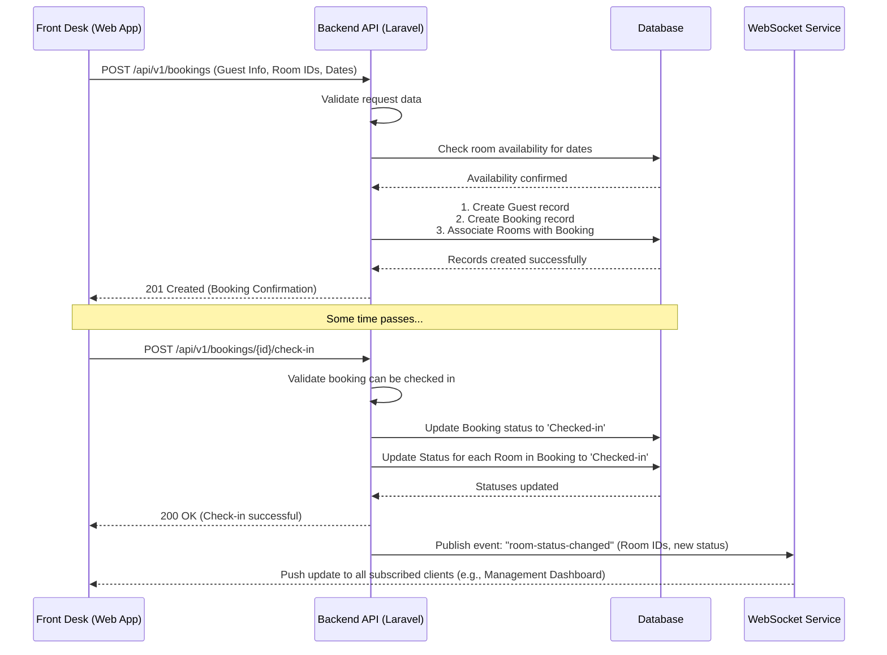

# Application Flow: New Booking and Check-In

This document illustrates the sequence of events for one of the most common user stories: a front desk staff member creating a new booking and later checking in the guest.

## Sequence Diagram

## Flow Description

1.  **Create Booking**:
    -   The Front Desk staff fills out the booking form in the web application with guest details, selected rooms, and check-in/check-out dates.
    -   The client sends a `POST` request to the `/bookings` endpoint.
    -   The API validates the incoming data (e.g., are all required fields present?).
    -   It queries the database to ensure the selected rooms are available for the requested date range.
    -   If available, the API creates the new `Guest` and `Booking` records in the database.
    -   The API returns a `201 Created` response to the client with the details of the new booking.

2.  **Check-In Guest**:
    -   On the day of arrival, the Front Desk staff finds the booking and clicks the "Check-in" button.
    -   The client sends a `POST` request to the `/bookings/{id}/check-in` endpoint.
    -   The API validates that the booking is valid for check-in.
    -   It updates the status of the `Booking` and the associated `Rooms` in the database to 'Checked-in'.
    -   The API returns a `200 OK` response to confirm the check-in.
    -   **Real-time Update**: The API then publishes an event to the WebSocket service, indicating that the room statuses have changed.
    -   The WebSocket service broadcasts this update to all connected and subscribed clients, so dashboards and room status views are updated instantly across the application without needing a page refresh.
