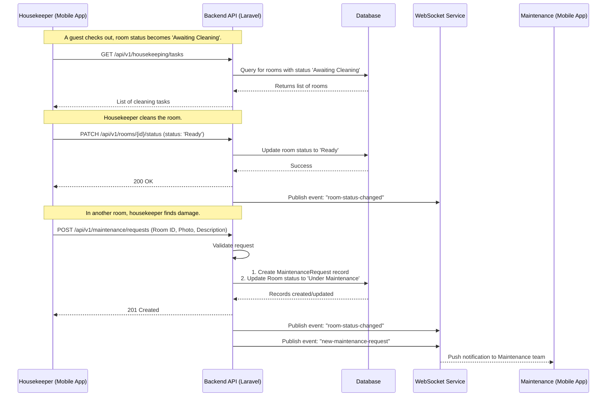

# Application Flow: Housekeeping and Maintenance

This document illustrates the sequence of events for a common operational workflow: a housekeeper cleaning a room and reporting damage, which then triggers a maintenance task.

## Sequence Diagram

## Flow Description

### 1. Cleaning a Room
-   A guest checks out, and the system automatically sets the room status to 'Awaiting Cleaning'.
-   The housekeeper opens their mobile app and requests their list of tasks. The app calls the `GET /housekeeping/tasks` endpoint.
-   The API queries the database for rooms assigned to that housekeeper (or all available cleaning tasks) with the status 'Awaiting Cleaning'.
-   After cleaning a room, the housekeeper taps a "Cleaning Complete" button in the app.
-   The app sends a `PATCH` request to update the room's status to 'Ready'.
-   The API updates the database and triggers a real-time event to notify other parts of the system (like the front desk dashboard) that the room is now available.

### 2. Reporting Damage
-   While cleaning a room, the housekeeper discovers a broken item.
-   They use the "Report Damage" feature in their app, filling in details and optionally taking a photo.
-   The app sends a `POST` request to the `/maintenance/requests` endpoint.
-   The API validates the data, creates a new `MaintenanceRequest` record in the database, and crucially, updates the `Room` status to 'Under Maintenance' to prevent it from being booked.
-   The API then fires two real-time events:
    1.  A `room-status-changed` event, so the front desk immediately sees the room is out of service.
    2.  A `new-maintenance-request` event, which sends a push notification directly to the mobile apps of the maintenance team, alerting them to the new task.
