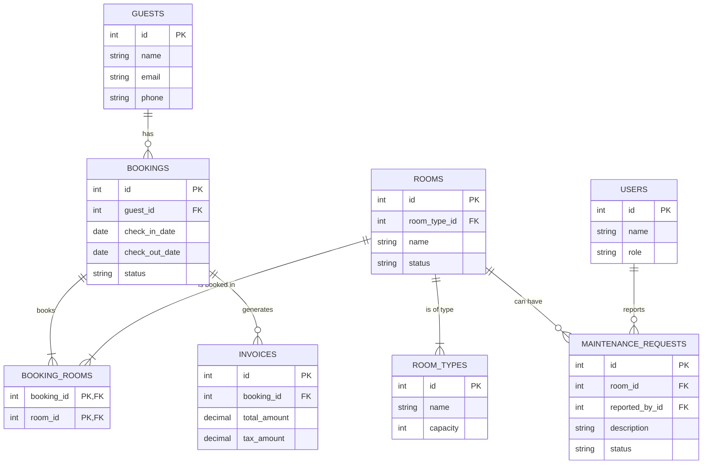

# Data Model (Entity-Relationship Diagram)

This document provides a high-level Entity-Relationship Diagram (ERD) illustrating the core entities of the Resort Hotel Management System and their relationships. This is a simplified model focusing on the main operational data within a single tenant's schema.

## ERD

## Key Relationships

-   **Guests and Bookings**: A `GUEST` can have one or more `BOOKINGS`. Each `BOOKING` belongs to exactly one `GUEST`.
-   **Bookings and Rooms**: A `BOOKING` can include one or more `ROOMS`, and a `ROOM` can be part of many `BOOKINGS` over time (but not at the same time). This many-to-many relationship is resolved by the `BOOKING_ROOMS` pivot table.
-   **Rooms and Room Types**: Each `ROOM` is of a specific `ROOM_TYPE`, which defines its characteristics like name ('Deluxe') and capacity.
-   **Bookings and Invoices**: A `BOOKING` typically results in one `INVOICE` upon check-out.
-   **Rooms and Maintenance**: A `ROOM` can have multiple `MAINTENANCE_REQUESTS` over its lifetime. Each request is linked to the specific room that needs attention.
-   **Users and Maintenance**: A `USER` (like a housekeeper) can report a `MAINTENANCE_REQUEST`. This helps track who reported the issue.
