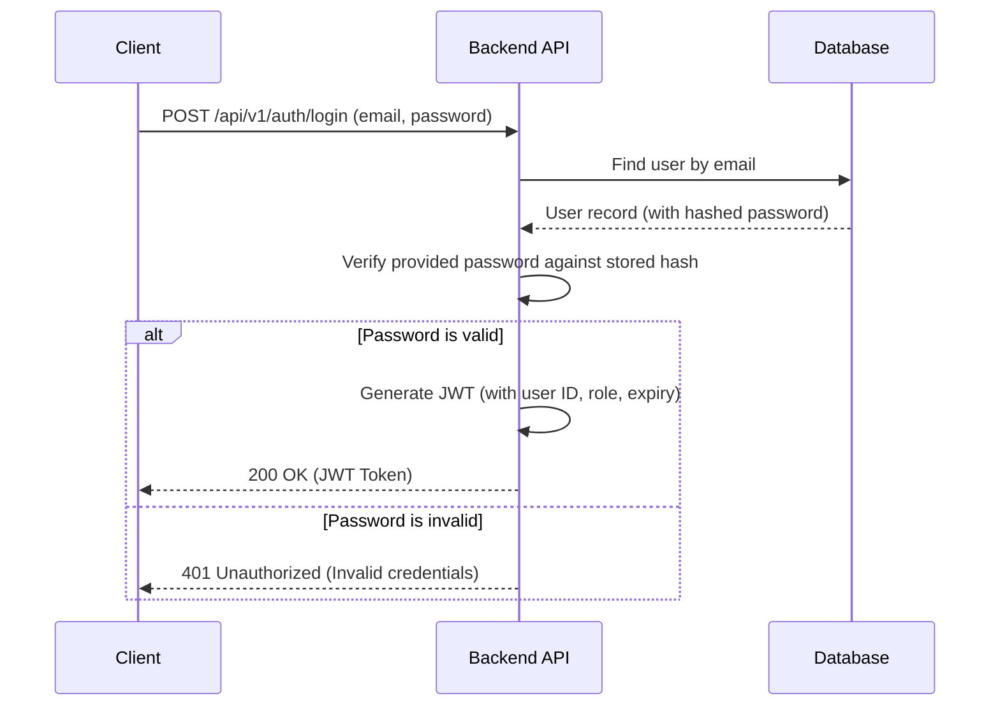
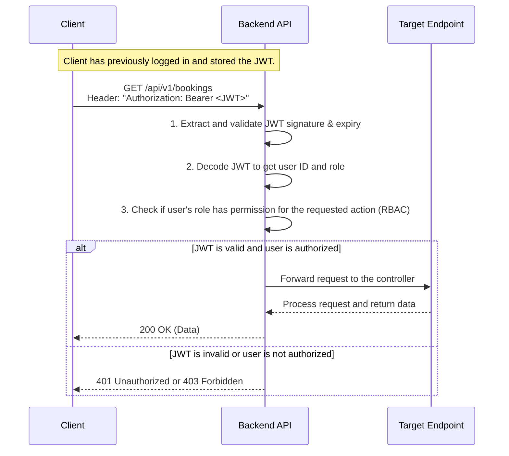

# Authentication and Authorization Flow

This document details the process of user authentication and how authorization is handled for API requests using JSON Web Tokens (JWT).

## Authentication Sequence (Login)

### Description
1.  The user enters their credentials (email and password) into the client application.
2.  The client sends a `POST` request to the `/auth/login` endpoint.
3.  The API looks up the user in the database by their email address.
4.  If the user is found, the API uses a secure hashing algorithm (like Bcrypt) to compare the provided password with the stored hash.
5.  If the password is correct, the API generates a JWT. This token is a signed, self-contained JSON object that includes a payload with key information like `user_id`, `role`, and an `exp` (expiration) timestamp.
6.  The API sends this JWT back to the client.
7.  If the credentials are incorrect, the API returns a `401 Unauthorized` error.

---

## Authorization Sequence (Authenticated API Request)

### Description
1.  For any subsequent request to a protected endpoint, the client must include the stored JWT in the `Authorization` header.
2.  An API middleware intercepts the incoming request before it reaches the target controller.
3.  This middleware performs several checks:
    -   **Token Validation**: It verifies the token's signature to ensure it hasn't been tampered with and checks its expiration date.
    -   **User Identification**: It decodes the token to identify the user making the request.
    -   **Authorization (RBAC)**: It checks if the user's role (also contained in the token or retrieved from the database) has the necessary permission to perform the requested action (e.g., does a 'Housekeeper' have permission to `GET /bookings`?).
4.  If all checks pass, the request is forwarded to the intended controller for processing.
5.  If any check fails, the middleware immediately returns an error (`401 Unauthorized` for an invalid token, `403 Forbidden` for insufficient permissions), and the request never reaches the controller.
